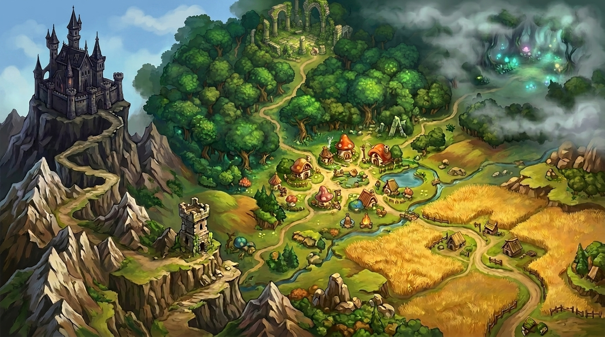
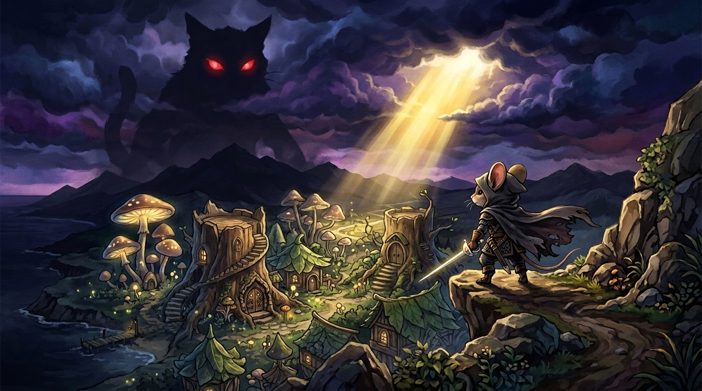

# East Grevie Adventures

[](LICENSE)
[](https://developer.mozilla.org/en-US/docs/Web/HTML)
[](https://developer.mozilla.org/en-US/docs/Web/CSS)
[](https://developer.mozilla.org/en-US/docs/Web/JavaScript)
[](tests/qa_full_game_sweep.js)

An immersive retro Web RPG featuring **25 painterly Vanillaware-style 2D illustrations**, **neural storyteller voice narration**, an interactive **overworld map**, **4 playable hero classes**, **15 unlockable achievement trophies**, and a **headless automated simulation test suite**.

<p align="center">
  
  
</p>

---

### [Play Game Live in Browser](https://miken908.github.io/east-grevie-adventures/)

---

## Production & Engineering Retrospective

* **Delivery Sprint**: Rapid pre-production & delivery sprint.
* **Production Workflow**: Executed with a Lead Producer & Product Owner mindset, harnessing GenAI tools (Antigravity & Gemini) as an accelerated virtual engineering and art pipeline across 100+ iterative commits.
* **Zero-Dependency Architecture**: Built entirely with vanilla HTML5, CSS3, and ES6+ JavaScript, requiring zero build steps, transpilers, or third-party framework overhead for instant browser execution.
* **Deterministic State Machine**: Employs a fail-proof state engine managing hero stats, inventory items, quest flags, and location transitions with `localStorage` meta-progression persistence.
* **Audio Engineering**: Features a custom Web Audio API synthesizer for retro soundscapes and asynchronous Web Speech API integration for storyteller voice narration.
* **Responsive 16:9 Display Frame**: Designed inside a widescreen 1240px arcade bezel container scaled dynamically for desktop and high-DPI displays.

---

## Core Game Features

### Vanillaware-Style 2D Artwork & Interactive Lightbox
- **25 Painterly 2D Illustrations**: High-definition digital artwork featuring a hand-drawn Vanillaware aesthetic (inspired by *Odin Sphere* and *GrimGrimoire*) for every location, character, and encounter.
- **Dynamic Storytelling Scenes**: Location and combat artwork dynamically transition to reflect story progression and key narrative beats.
- **Interactive Lightbox Gallery**: Fullscreen image viewer accessible from the main menu featuring keyboard arrow navigation (`◄` / `►`) and card indexing (`1 / 25`).

### Widescreen Modal UI & HD Typography
- **Spacious Dialog Overlay System**: Standardized 1080px widescreen modal boxes with high-contrast HD typography (`1.05rem - 1.5rem`), padded controls, and unified dark blue/cyan styling across all dialogs.
- **Interactive Hero Status Screen**: 3-column overview displaying hero portrait, attribute point allocation, equipment slots, and derived combat metrics.

### Playable Hero Archetypes & Class Perks
- **Royal Knight**: Defensive warrior starter class with the `Bastion Shield` perk (-2 damage taken).
- **Woodland Ranger**: High agility starter class featuring `Eagle Eye` (+10% Crit Chance & +10% Dodge).
- **Royal Alchemist**: Resource master class featuring `Elixir Master` (+60 HP potions & extra merchant gold).
- **Sunblade Paladin**: Exclusive **New Game+** hero class unlocked by claiming all 15 Achievement Trophies (`Holy Guard` & `Sunfire Cleave`).

### Dynamic Combat & Visual Feedback
- **Multi-Tiered Floating Combat Text**: Real-time animated indicators for damage dealt, critical strikes, damage mitigation, dodges, and healing.
- **Real-Time Combat Log**: Event feed tracking strike outcomes, turn states, and passive class perk triggers.

### Quest Journal & Flexible Progression Logic
- **Structured Quest Tracking**: Interactive journal managing 3 core storylines with objective checkmarks:
  1. **MAIN QUEST**: *Rescue Princess Elsa* (4 explicit milestones: Wise Elder -> Sunblade Reforging & Consecration -> Boss Defeat -> Escort Elsa).
  2. **CELESTIAL SUBQUEST**: *Reforging the Sunblade* (Collect 3 ancient relics across the realm & consecrate at Temple Sanctum).
  3. **BLACKSMITH SUBQUEST**: *Stolen Mastercraft Blueprint* (Locate Goblin Rogue & recover stolen forge blueprint).
- **Flexible Reforging Logic**: Ancient relic reforging at the Blacksmith operates independently of commercial shop unlocks to prevent progression gating.

### Achievement Trophy Room & Meta-Progression
- **15 Persistent Trophies**: Tracks combat milestones, lore discoveries, secret encounters, and wilderness monster kills saved in `localStorage`.
- **Animated Toast Banners**: Sliding notification banners when achievements trigger during gameplay.
- **New Game+ Unlock**: Completing all 15 trophies permanently awakens the Sunblade Paladin on the hero creation screen.

### Neural Voice Narration & Audio Bus
- **Smart Voice Auto-Selection**: Asynchronous Web Speech API integration that automatically detects and locks onto the highest-quality HD/Neural voice on the player's operating system without manual setup.
- **Dynamic Audio Ducking**: Background music automatically lowers volume during narrator audio lines for voiceover clarity.
- **Audio Control Center**: Independent volume controls for Master, Music, Sound Effects, and Voiceover Narration.

---

## Automated Testing & QA Suite

This repository features a zero-dependency automated testing suite written in Node.js:

```bash
# Run full static system check and dynamic state simulation suite
node tests/qa_full_game_sweep.js
```

### QA Test Suite Summary (201 / 201 Passed - 100% Success Rate)
- **177 Static System Checks**: Verifies HTML DOM bindings, CSS layout definitions, function signatures, and event handlers.
- **24 Headless Dynamic Simulations**: Mocks player actions step-by-step in Node.js (clean slate initialization, quest discovery, combat calculations, objective tracking, and playthrough resets).

---

## Local Development & Setup

1. **Clone the Repository**:
   ```bash
   git clone https://github.com/Miken908/east-grevie-adventures.git
   cd east-grevie-adventures
   ```

2. **Run in Browser**:
   - Open `index.html` directly in any web browser or use VS Code Live Server.

3. **Execute Test Suite**:
   ```bash
   node tests/qa_full_game_sweep.js
   ```

---

## Credits & License

- **Game Director & Producer**: Miken908
- **AI Development Partner**: Antigravity (Google DeepMind)
- **Visual Art & Audio Production**: Created with Google Gemini AI (Vanillaware 2D Illustration Style) & Web Audio Synthesizer
- **License**: [MIT](LICENSE)
